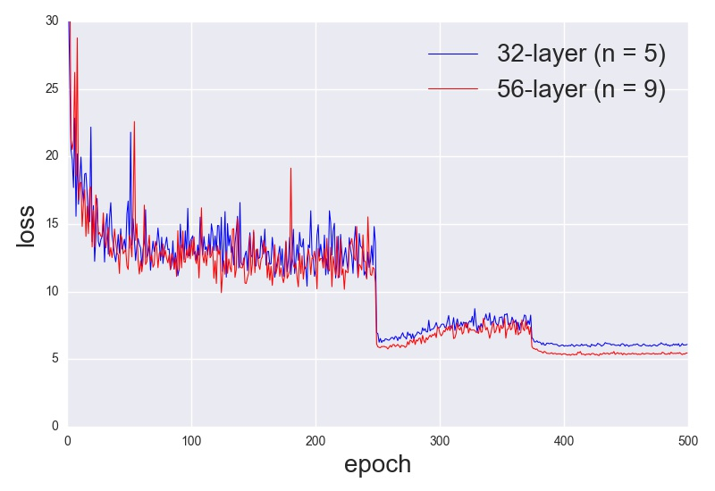

# stochastic-depth: "deep residual network with stochastic depth". 

Writing Python (Lasagne + Theano library) code for CIFAR-10 classification, based on:

* 2015: [Deep Residual Learning for Image Recognition](https://arxiv.org/abs/1512.03385)

* 2016: [Deep Networks with Stochastic Depth](http://arxiv.org/abs/1603.09382)

* I am also re-using some helper functions from [Deep_Residual_Learning_CIFAR-10.py](https://github.com/Lasagne/Recipes/blob/master/papers/deep_residual_learning/Deep_Residual_Learning_CIFAR-10.py) taken from <https://github.com/Lasagne/Recipes>

Some results:

